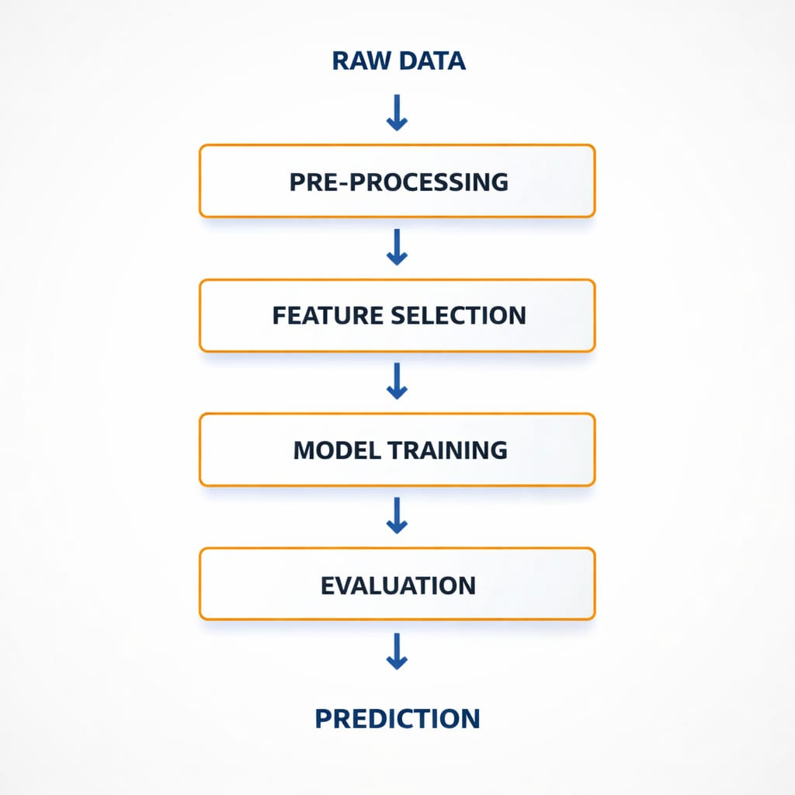

# 🩺 Diabetes Prediction System

A Machine Learning based web application that predicts the risk of diabetes using medical health parameters.  
This project uses a trained Random Forest model and provides real-time prediction through a Flask web interface.

---

## 📌 Project Overview

The Diabetes Prediction System analyzes medical attributes such as:

- Glucose Level
- Blood Pressure
- BMI
- Insulin
- Age
- Pregnancies
- Skin Thickness
- Diabetes Pedigree Function

Using these features, the system predicts whether a person is likely to have diabetes and displays the probability percentage.

---

## 🚀 Features

✔ Real-time Diabetes Risk Prediction  
✔ Probability Score Display  
✔ Clean Web Interface using Flask  
✔ Machine Learning Model (Random Forest)  
✔ Data Preprocessing & Feature Scaling  
✔ Structured Project Architecture  

---

## 🛠️ Tech Stack

- Python
- Flask
- Scikit-learn
- Pandas
- NumPy
- HTML
- CSS

---

## 📂 Project Structure

```
Diabetes-Prediction-System/
│
├── dataset/                # Contains diabetes dataset (CSV file)
├── static/                 # CSS, images, and frontend assets
├── templates/              # HTML files (index.html, result.html)
├── .gitignore              # Ignored files
├── README.md               # Project documentation
├── app.py                  # Main Flask application
├── requirements.txt        # Project dependencies
└── train_model.py          # Model training script
```
# 3️⃣ Demos

Fusion RAG Doc Chat operates like an intelligent research assistant that
retrieves and verifies information before generating responses.

<p align="center">
 
</p>


---

## ⚙️ Installation & Setup

### 1️⃣ Clone the Repository

```bash
git clone https://github.com/harshith123-26/Diabetes-prediction-system.git
cd diabetes-prediction-system
```

### 2️⃣ Create Virtual Environment (Optional but Recommended)

```bash
python -m venv venv
venv\Scripts\activate      # For Windows
source venv/bin/activate   # For Mac/Linux
```

### 3️⃣ Install Dependencies

```bash
pip install -r requirements.txt
```

---

## 🧠 Train the Model

```bash
python train_model.py
```

This will train the Random Forest model and save the trained model file.

---

## ▶️ Run the Application

```bash
python app.py
```

Open your browser and go to:

```
http://127.0.0.1:5000/
```

---

## 📊 Machine Learning Workflow

1. Data Loading
2. Data Preprocessing
3. Feature Scaling
4. Train-Test Split
5. Model Training (Random Forest)
6. Model Evaluation
7. Deployment using Flask

---

## 📈 Model Used

Random Forest Classifier

Reason for selection:
- Handles non-linear data well
- Good accuracy
- Reduces overfitting compared to Decision Trees

---

## 📌 Future Improvements

- Add XGBoost Model
- Add Multi-Disease Prediction
- Add User Authentication
- Deploy on Cloud (Render/Heroku)
- Add Dashboard Analytics

---

  


